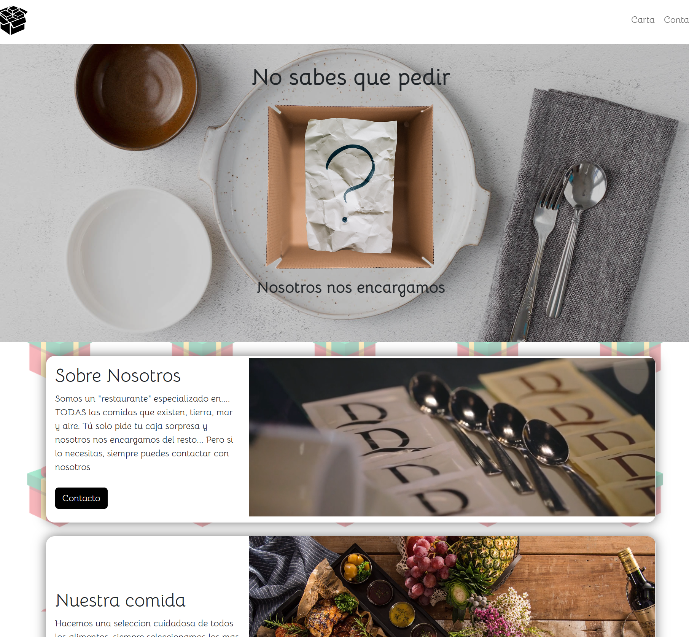
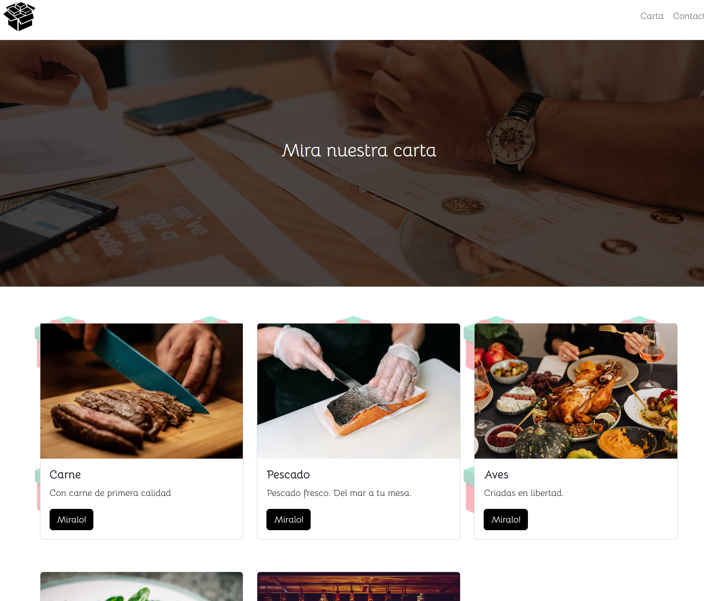
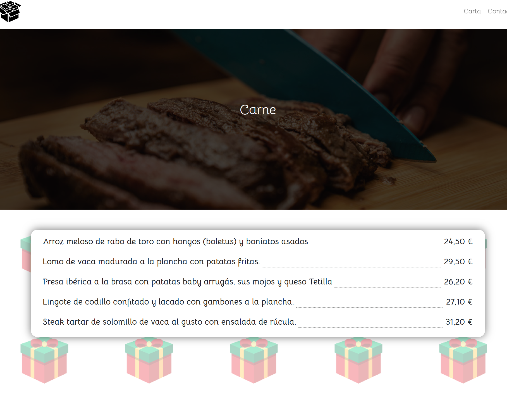
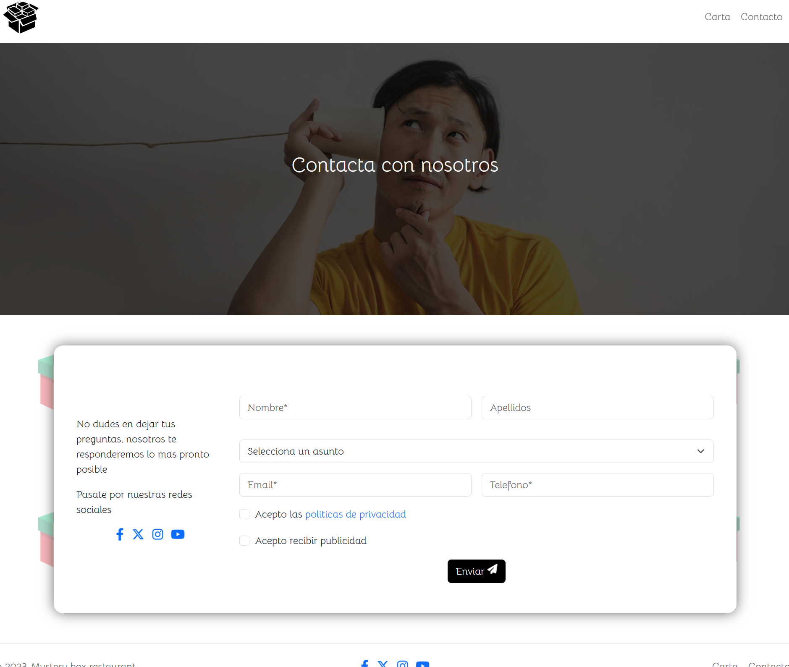

# Mystery restaurant

Somos un restaurante con un concepto totalmente nuevo, todos tenemos días en los que tenemos hambre, pero no sabemos de qué, pero no te preocupes, tú solo pide y nosotros nos encargamos de entregarte nuestra mystery box y disfruta.

## Construido con 🛠️

* [HTML]
* [CSS]
* [OWL CAROUSEL](https://owlcarousel2.github.io/OwlCarousel2/) - Usado para el slider principal de la pagina
* [BOOTSTRAP](https://getbootstrap.com/) - Usado para la estructura base de la web y el responsive
* [JQUERY](https://jquery.com/) - Usado para configurar el carousel

## Deploy 🚀

* Url de [producción](jorgelozadev.github.io/restaurante/) 

## Wiki 📖

Ahora te explicaremos como funciona nuestra web.

Home

Aquí te encontrarás con un carousel, en el primer elemento podrás hacer click y este te llevará a la página de la carta.
También te encontrarás con 2 cajas. En la primera te explicamos un poco sobre nosotros y un botón para llevarte a la página de contacto. En la siguiente caja te explicamos un poco de nuestra comida

Carta

En esta página te encontrarás las distintas opciones que tenemos para ofrecerte, para ver más en detalle, simplemente tienes que pinchar en el botón correspondiente.

Carta detalle

Aquí podrás ver una lista de nuestra carta.

Contacto

En esta página te encontrarás, con más información de nuestra empresa, nuestras redes sociales y el formulario de contacto.

## Autores ✒️

* **Jorge Loza Guzmán** - *Trabajo Inicial* -  *Documentación* - [JorgeLozaDev](https://github.com/JorgeLozaDev)

## Licencia 📄

Este proyecto está bajo la Licencia (LICENSE) - mira el archivo [LICENSE](LICENSE) para detalles

---
⌨️ por [JorgeLozaDev](https://github.com/JorgeLozaDev) 